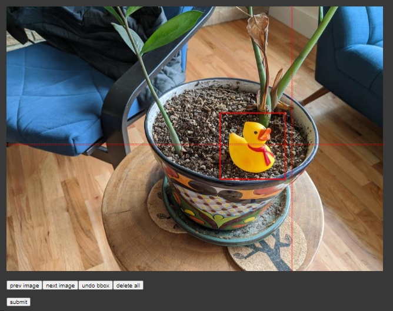

# Deep Dive: Tensorflow 2 Object Detection API

**TL;DR: not a tutorial, just some helpful resources and utility scripts to ease your custom training**

The Tensorflow 2 Object Detection API is by far the best way to train state-of-the-art models by Google, especially for beginners.

# Resources

Many resources already exist that allow you to train your own object detector on custom data:

* [The official custom training guide from Google research](https://github.com/tensorflow/models/blob/master/research/object_detection/g3doc/tf2_training_and_evaluation.md)
    * Provides code snippets of how to run the scripts e.g. `model_main_tf2.py`
    * But doesn't provide full guidance as to what to expect.
    * There used to be a [custom training guide for the cats and dogs dataset](https://github.com/tensorflow/models/blob/master/research/object_detection/g3doc/running_pets.md) for TF1, but in TF2, the Google team only provided a [few shot learning jupyter notebook](https://colab.research.google.com/github/tensorflow/models/blob/master/research/object_detection/colab_tutorials/eager_few_shot_od_training_tf2_colab.ipynb) (not complaining though).


* Google is also generous enough to release pretrained models in the [TF2 Model Zoo](https://github.com/tensorflow/models/blob/master/research/object_detection/g3doc/tf2_detection_zoo.md)
    * So we can fine tune on small datasets in the order of thousands and still get near world class results. All hail transfer learning.


* This [unofficial tutorial](https://tensorflow-object-detection-api-tutorial.readthedocs.io/en/latest/) on www.readthedocs.io is excellent for beginners, guiding us through every step, from data labelling to model configuration to training to model export and inference. Kudos to the creator!
    * But I feel like many of the parts are too manual (`label_map.pbtxt` and `pipeline.config` creation) and can be automated since there is no variation in those steps.


* Finally, I found an [old colab](https://colab.research.google.com/github/cloud-annotations/google-colab-training/blob/master/object_detection.ipynb) which uses the TF1 OD API to train on Google Cloud PLatform.
    * This was a goldmine, because it showed the usage of the internal utility functions that can be used to create `label_map.pbtxt` and `pipeline.config` very easily.


* Similarly, the [few shots learning](https://colab.research.google.com/github/tensorflow/models/blob/master/research/object_detection/colab_tutorials/eager_few_shot_od_training_tf2_colab.ipynb) notebook demonstrated usage of a custom training loop and model creation, which is great for beginners.

* Lastly, if you have the patience to read through the [`/object_detection/` files and folders](https://github.com/tensorflow/models/blob/master/research/object_detection/), you can find hundreds of documentations written at the start of the functions.

I am not going to write the typical tutorial therefore. What I am going to do is compile some of the stuff I have found and put it in a single place. Let's dive in!

# Label Images in Colab

You can obviously label your data with tools like [LabelImg](https://github.com/tzutalin/labelImg), but if you want to conviniently label some images within colab, there's a tool!

``` python
from object_detection.utils import colab_utils

gt_boxes = []
colab_utils.annotate(train_images_np, box_storage_pointer=gt_boxes)
```

View full usage: [Source](https://github.com/tensorflow/models/blob/master/research/object_detection/colab_tutorials/eager_few_shot_od_training_tf2_colab.ipynb)



After labelling, the `gt_boxes` will look like this:
```
gt_boxes = [
    np.array([[0.436, 0.591, 0.629, 0.712]], dtype=np.float32),
    np.array([[0.539, 0.583, 0.73, 0.71]], dtype=np.float32),
    np.array([[0.464, 0.414, 0.626, 0.548]], dtype=np.float32),
    np.array([[0.313, 0.308, 0.648, 0.526]], dtype=np.float32),
    np.array([[0.256, 0.444, 0.484, 0.629]], dtype=np.float32)
]
```
That is, a list of `[x_min, y_min, x_max, y_max]`, where all `x`s and `y`s are between 0 and 1.

# Create TFRecords from Various Annotation Formats

TFRecord files are promoted and used by Google as an efficient way to construct in the input data pipeline.

Generating them can be hard at first try. There is a helpful function [here](https://github.com/tensorflow/models/blob/master/research/object_detection/g3doc/using_your_own_dataset.md).

But if you are using labelImg or some other dataset (say, in my case I was dealing with XML files in the PASCAL VOC format), then you can explore [the `/dataset_tools/` folder](https://github.com/tensorflow/models/tree/master/research/object_detection/dataset_tools) to find a lot of scripts for popular datasets like KITTI and COCO. You have to tweak those scripts to your needs.

For example, I wrote this [gist](https://gist.github.com/yasserius/ef9eb79c3f2f516ed1e4f793150d6f76) for PASCAL VOC XML to TFRecords converter.

With this, you have to generate `train.record` and `val.record` files.

# Edit the Configuration Files from Model Zoo

The `pipeline.config` file is paramount for training the model using the API. 

When you download a model from the [TF2 Model Zoo](https://github.com/tensorflow/models/blob/master/research/object_detection/g3doc/tf2_detection_zoo.md) and untar the package, you will find the config file for that model.

It contains the model architectural specification (e.g. number of layers and their types), hyperparameters (learning rate, dropout probability), path to label maps, train and validation TFRecord file paths; pretty much every piece of information needed for training. You can see some samples in [the `/configs/tf2` folder](https://github.com/tensorflow/models/tree/master/research/object_detection/configs/tf2).

If you want to write your own from scratch, there's a not-so-helpful [official document](https://github.com/tensorflow/models/blob/master/research/object_detection/g3doc/configuring_jobs.md). But you don't have to write from scratch. You can just edit the one from model zoo.

Now, in order to avoid editing it manually, there are util functions. An example of the usage:
``` python
from google.protobuf import text_format

from object_detection.utils import config_util
from object_detection.utils import label_map_util

pipeline_skeleton = "somewhere/pipeline.config"
configs = config_util.get_configs_from_pipeline_file(pipeline_skeleton)

label_map = label_map_util.get_label_map_dict("somewhere/label_map.pbtxt")
num_classes = len(label_map.keys())
meta_arch = configs["model"].WhichOneof("model")

override_dict = {
  'model.{}.num_classes'.format(meta_arch): num_classes,
  'train_config.batch_size': 24,
  'train_input_path': "somewhere/train.record",
  'eval_input_path': "somewhere/val.record",
  'train_config.fine_tune_checkpoint': "somewhere/model.ckpt",
  'label_map_path': "somewhere/label_map.pbtxt"
}

configs = config_util.merge_external_params_with_configs(configs, kwargs_dict=override_dict)
pipeline_config = config_util.create_pipeline_proto_from_configs(configs)
config_util.save_pipeline_config(pipeline_config, "destination/")
```

See full usage: [Source](https://colab.research.google.com/github/cloud-annotations/google-colab-training/blob/master/object_detection.ipynb#scrollTo=UXlvFvwUHrui)

There's a lot to process here, but you will get a hang of it when you start doing it.

# Input Arguments to `model_main_tf2.py`

If you go read the insides of [`model_main_tf2.py`](https://github.com/tensorflow/models/blob/master/research/object_detection/model_main_tf2.py), you will find lots of arguments to tweak.

There are two modes of this file:

1. **Training:**
    ``` bash
    !python  "somewhere/object_detection/model_main_tf2.py" \
        --alsologtostderr
        --pipeline_config_path="somewhere/pipeline.config" \
        --model_dir="somewhere/trained_output" \
        --num_train_steps=25000 \
        --checkpoint_every_n=1000
        
    ```  
    * The first three arguments are self-explanatory.

    * The `--num_train_steps=25000` means that the training will occur for 25000 time steps i.e. 25000 batch passes.
    
    * The `--checkpoint_every_n=1000` argument saves a `ckpt` weights file every 1000 time steps (1 time step = 1 batch processed). If you are going to train for 200~300 epochs and don't want redundant checkpoints, then set this to something high, like 2000 or 4000.

2. **Evaluation:**
    While the training is running, you have to open another terminal (or colab) and run this:
    ``` bash
    !python  "somewhere/object_detection/model_main_tf2.py" \
        --alsologtostderr
        --pipeline_config_path="somewhere/pipeline.config" \
        --model_dir="somewhere/trained_output" \
        --checkpoint_dir="somewhere/trained_output" \ #must be same as model_dir
    ```  
    * The first three arguments are same as before.

    * The `--checkpoint_dir` argument makes the script do evaluations from the `val.record` TFRecord file you mentioned in `pipeline.config`. You will be find some evaluation files in `somewhere/trained_output/eval` directory, containing mAP values and classificationa accuracies, among other things. Read more about [evaluation](https://github.com/tensorflow/models/blob/master/research/object_detection/g3doc/evaluation_protocols.md).

# Fixing PNG File Inputs: Remove the 4th channel

A silly error might occur if you are using PNG images, because when `PIL` opens it, it returns an RGBA image, with an extra channel, which will break the inference program.

Simple `numpy` slicing fixes it:
``` python
from PIL import Image
import numpy as np

img = Image.open("1.png")
img = np.array(img)
img = img[:, :, 0:3]
```
Afterwards, you can input the numpy image into the [inference program](https://tensorflow-object-detection-api-tutorial.readthedocs.io/en/latest/auto_examples/plot_object_detection_checkpoint.html#sphx-glr-auto-examples-plot-object-detection-checkpoint-py).

# Closing thoughts

Hope you found the code snippets and resources useful.
I have a [colab](https://colab.research.google.com/github/yasserius/satellite_image_tinhouse_detector/blob/main/training.ipynb) with the full training code if you want a full working example.
Thanks!
